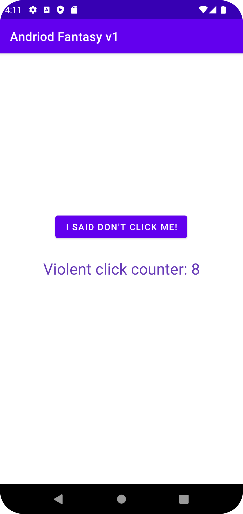

# 100 Days of Android Developer 

100 Days of Android Developer is an challenge project I want to capture the moment that I learn to be an andriod developer for the next 100 days from scratch with no experience and knowlage about this path. I am commited to take this challenge for improve my skills, make learning habit, and push my boundaries.

#### My Daily Quest
1. Code a minimum of an hour every day (except saturday or sunday) for the next 100 days. (Work hours is not included)
2. Update my progress everyday on github.
#### My Exceptions
1. If I break the streak, I will make sure that I won't break it the next day.
2. If I have an emergencies day I will take a day off.
## Day 1 | 
Date: 16/07/2022
- Solved Kotlin Programming Challenges
  - Tax Calculator
  - Letter Counter
  - Parking Fee
  - Shipping Calculator
- Learned Kotlin
  - Functions
  - Lambdas and Higher-order Functions
## Day 2 |   
Date: 18/07/2022
- Solved Kotlin Programming Challenges
  - Music Player
- Learned Kotlin
  - Classes and Objects
  - OOP
- Practice to be familar with Android Studio
  - Make my first andriod app <a href="https://github.com/natersland/Andriod-Fantasy-V1---Counter-App.git">Android Fantasy v1 - Counter App</a>
- Archived <a href="https://www.sololearn.com/certificates/course/en/18122496/1160/landscape/png">Kotlin Certificate</a>, Sololearn

## Day 3 |   
Date: 19/07/2022
- Solved Kotlin Programming Challenges
  - Self-Grading Quiz
- Learned Kotlin
  - Anatomy of an Andriod App
  - Kotlin Fundamentals
    - Nullables In Kotlin
    - Nullables - Elvis Operator - Not Null Assertion
- Learned Version Control
    - Unix Commands
      - Pipes
      - Redirection
      - Grep
      
## Day 4 |    
Date: 20/07/2022
- Solved Kotlin Programming Challenges
  - Kotlin 500 Challenge | Data Structure
  - Kotlin 500 Challenge | Problems
- Learned Professional Android Development
  - Android Devices
  - Developing for Android
- Learned Version Control
  - Working with Git
    - Resolving conflicts
    - HEAD
    - Diff commands
    - Blame

## Day 5 | 
Date: 21/07/2022
- Solved Kotlin Programming Challenges
  - Login System
- Learned Kotlin
  - Null Safety 
  - File Management
  - Collection 
    - Hashmap
- Certificated: <a href="https://www.coursera.org/account/accomplishments/verify/W8N5S5VD5T65">Version Control</a>, Meta

